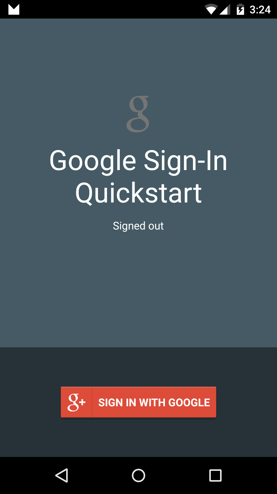

# Google Sign-In Sample

This sample demonstrates how to authenticate a user with the GoogleSignIn Client in Google Play Services.

## Setup

* You must follow the next guide to configure the Sign-In feature: https://developers.google.com/identity/sign-in/android/start

## Instructions

* Tap the "Sign in with Google" button to sign in.
* Tap the "Sign Out" button to sign out of the current session.

## Troubleshooting

* DEVELOPER_ERROR: Make sure you're using the generated android debug keystore by Xamarin for generate SHA-1. Check [this article](https://docs.microsoft.com/xamarin/android/deploy-test/signing/keystore-signature) to get it.

Note: Make sure you've authorized the app in the [Google Developers Console](https://console.developers.google.com/project) before use.

## Build Requirements

Using this sample requires the Android SDK platform for Android 5.0+ (API level 21).

## License

Copyright (c) 2015 Google, Inc.

Ported from [Google Sign-In Sample](https://github.com/googlesamples/google-services/tree/master/android/signin)
